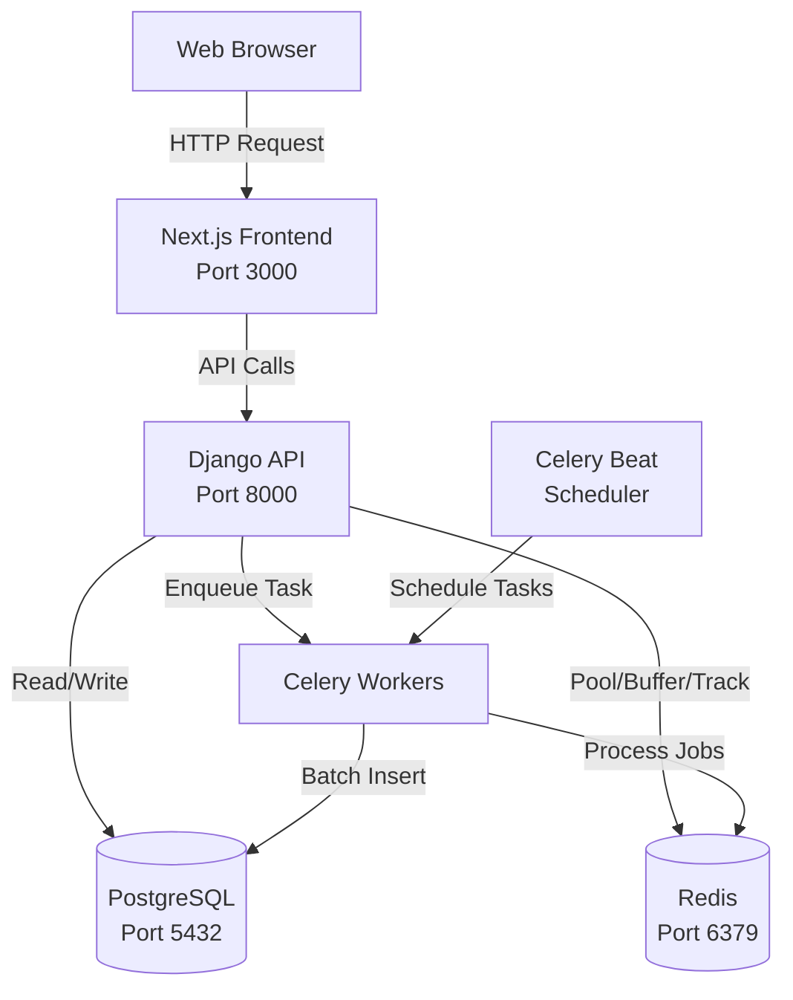

# 🔗 URL Shortener

A production-ready URL shortening service built with Django and Next.js, featuring advanced analytics, fraud detection, and intelligent redirection rules.


## Overview

This URL shortener addresses the need for a **high-performance, enterprise-grade** link management system with comprehensive analytics and security features. Unlike basic URL shorteners like bit.ly or TinyURL, this system provides advanced capabilities including multi-window burst protection, Redis-backed analytics buffering, intelligent redirection rules, and comprehensive fraud detection.

Built for developers and businesses who need more than just link shortening. The system handles high-traffic scenarios with Redis buffering (reducing redirect latency from 50ms to <10ms), provides granular analytics with device/browser/location tracking, and includes enterprise features like audit logging, role-based access control, and automated link health monitoring.

The architecture leverages a **modular monolith pattern** with Django apps as modules and Celery for asynchronous processing, striking the perfect balance between simplicity and scalability for small to medium-scale deployments.

**Key Differentiators:**

- **Redis-buffered analytics** - Non-blocking visit tracking with batch processing (6x faster redirects)
- **Short code pool** - Pre-generated code pool eliminates collision retries
- **Multi-window burst protection** - Advanced fraud prevention with 10s/60s/3600s detection windows
- **Priority-based redirection rules** - Conditional redirects based on country, device, browser, OS, time
- **Link rot detection** - Automated health checking with async batch processing
- **Comprehensive admin system** - Full-featured admin panel with insights, audit logs, and fraud monitoring

## 🌟 Feature Matrix

| Feature | Status | Technical Highlight |
|---------|--------|---------------------|
| URL Shortening | ✅ | Redis-backed short code pool with `[a-zA-Z0-9]` character set |
| Custom Aliases | ✅ | Unique constraint validation with collision detection |
| Analytics Dashboard | ✅ | Redis buffering with bulk inserts (100 events/batch) |
| QR Code Generation | ✅ | On-demand QR code generation via API endpoint |
| Fraud Detection | ✅ | Multi-window burst protection + suspicious UA detection |
| Link Expiration | ✅ | Celery Beat scheduled cleanup with soft delete |
| Redirection Rules | ✅ | JSON-based conditional routing with priority ordering |
| Link Health Check | ✅ | Async batch health checks with Redis queue |
| Audit Logging | ✅ | Full action tracking with JSON change history |
| Admin Panel | ✅ | Next.js admin interface with role-based permissions |
| Batch Operations | ✅ | Bulk URL creation (max 500 URLs/request) |
| User Authentication | ✅ | Cookie-based JWT with 3-tier role system (Admin/Staff/User) |

## 🛠️ Tech Stack

### Backend: Django 5.2 + Django REST Framework

**Why Django over alternatives (Flask, FastAPI, Node.js)?**

✅ **Pros:**
- Built-in ORM with migration system prevents SQL injection
- Admin interface saves weeks of development
- Batteries-included security defaults (CSRF, XSS protection)
- Mature ecosystem (DRF, Celery integration)

❌ **Cons:**
- Heavier than micro-frameworks
- Synchronous by default (mitigated with Celery for async tasks)

**Decision:** Django's built-in features (ORM, admin, auth) significantly accelerate development while maintaining security best practices. [Full architecture justification →](docs/architecture.md)

### Database: PostgreSQL

**Why PostgreSQL over alternatives (MySQL, MongoDB)?**

✅ **Pros:**
- ACID compliance ensures no duplicate short codes
- Advanced indexing (B-tree for lookups, composite indexes)
- JSON fields for flexible analytics/rule storage
- Excellent performance with proper indexes

❌ **Cons:**
- Requires more setup than SQLite
- Vertical scaling limits

**Decision:** URL relationships (User → URLs → Analytics) fit the relational model perfectly. UNIQUE constraints prevent collisions. [Database design docs →](docs/database.md)

### Cache: Redis

**Why Redis over alternatives (Memcached)?**

✅ **Pros:**
- Multiple use cases: short code pool, analytics buffer, burst protection, Celery broker
- Rich data structures (lists, sets, sorted sets, counters)
- Persistence options available
- Native Celery support

❌ **Cons:**
- Memory-based (expensive at massive scale)
- Single-threaded

**Decision:** Redis serves four critical needs: (1) short code pool management, (2) analytics buffering for non-blocking writes, (3) burst protection tracking, (4) Celery broker. Consolidating to one technology reduces operational complexity.

### Frontend: Next.js 16.1 + React 19

**Why Next.js?**

✅ **Pros:**
- App Router with server components
- Built-in routing and API routes
- Excellent TypeScript support
- Modern UI with Tailwind CSS + Radix UI

**Tech Stack Summary:**
- **Backend:** Django 5.2+ with Django REST Framework
- **Frontend:** Next.js 16.1+ with React 19
- **Database:** PostgreSQL with optimized indexes
- **Cache:** Redis with connection pooling
- **Task Queue:** Celery with Redis broker
- **Package Manager:** Bun (recommended) or npm
- **Containerization:** Docker & Docker Compose

## 📐 Architecture Overview



**Component Responsibilities:**

- **Next.js Frontend** - User interface with public/auth/user/admin route groups
- **Django API** - REST endpoints, business logic, authentication
- **PostgreSQL** - Persistent storage for URLs, users, analytics, audit logs
- **Redis** - Short code pool, analytics buffering, burst protection tracking, unique visitor sets
- **Celery Workers** - Async task processing (analytics batching, link health checks, cleanup)
- **Celery Beat** - Scheduled tasks (expired URL cleanup, pool refill, link rot checks)

[Detailed architecture documentation →](docs/architecture.md)

## 🎯 Key Design Decisions

### Analytics Buffering
**Problem:** Direct database writes add 20-50ms latency to redirects.

**Solution:** Buffer click events in Redis lists, batch-process every 5 minutes via Celery.

**Result:** Redirect latency reduced from 50ms → <10ms (6x improvement). [Details →](docs/deep-dive-analytics.md)

### Short Code Pool
**Problem:** On-demand generation can cause collision retries under load.

**Solution:** Pre-generate short codes in Redis Set pool, auto-refill when below 30% capacity.

**Result:** Zero-collision code allocation, consistent performance. [Details →](docs/design-decisions.md)

### Burst Protection
**Problem:** Malicious traffic can overwhelm URLs and database.

**Solution:** Multi-window detection (10s/60s/3600s) using Redis sorted sets, distributed locking, auto-flagging.

**Result:** Effective DDoS mitigation without impacting legitimate traffic. [Details →](docs/design-decisions.md)

## 🚀 Quick Start

### Prerequisites

-   **Python 3.8+** (3.11+ recommended)
-   **PostgreSQL** - Running on port 5432
-   **Redis** - Running on port 6379
-   **Bun** or **Node.js + npm** - For frontend

### Automated Setup (Recommended)

Our cross-platform Python scripts work on **Windows, Linux, and macOS**:

```bash
# 1. Clone the repository
git clone https://github.com/Georgesa98/UrlShortner.git
cd UrlShortner

# 2. Ensure PostgreSQL and Redis are running
# Windows: Start services from Services panel (services.msc)
# Linux: sudo systemctl start postgresql redis

# 3. Run one-time setup
python setup.py

# 4. Start all services (Django + Celery + Frontend)
python run.py
```

That's it! The scripts will:
- ✅ Check all dependencies
- ✅ Create virtual environment
- ✅ Install Python packages
- ✅ Install frontend dependencies
- ✅ Run database migrations
- ✅ Seed test data
- ✅ Start all services automatically

**Access the application:**
- Frontend: `http://localhost:3000`
- Backend API: `http://localhost:8000`
- Admin Panel: `http://localhost:3000/admin`

**Default credentials:**
- Username: `admin_tester`
- Password: `Password123!`

**To stop all services:**

```bash
python stop.py
```

Or press `Ctrl+C` in the terminal running `run.py`

### Manual Setup (Alternative)

<details>
<summary>Click to expand manual installation steps</summary>

```bash
# Clone the repository
git clone https://github.com/Georgesa98/UrlShortner.git
cd UrlShortner

# Backend setup
python -m venv .venv
source .venv/bin/activate  # Windows: .venv\Scripts\activate

pip install -r requirements.txt

# Setup environment
cp .env.example .env
# Edit .env with your database credentials

# Database setup
python manage.py migrate
python manage.py seed_data --users 5 --urls-per-user 20

# Frontend setup
cd frontend
bun install  # or: npm install
cd ..

# Start services manually (in separate terminals)
# Terminal 1: Django
python manage.py runserver

# Terminal 2: Celery Worker
celery -A config worker --loglevel=info

# Terminal 3: Celery Beat
celery -A config beat --loglevel=info --scheduler django_celery_beat.schedulers:DatabaseScheduler

# Terminal 4: Frontend
cd frontend && bun run dev  # or: npm run dev
```

</details>

## 🐳 Docker Setup (Alternative)

```bash
# Start all services with Docker
docker-compose up --build

# Access at http://localhost:8000
```

## 🤝 Contributing

Contributions are welcome! Please feel free to submit a Pull Request.

## 📄 License

This project is licensed under the MIT License.

---

⭐ If you find this project useful, please consider giving it a star!
