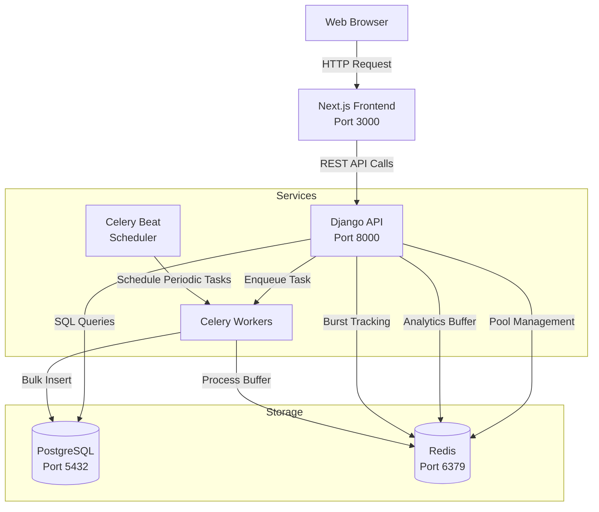
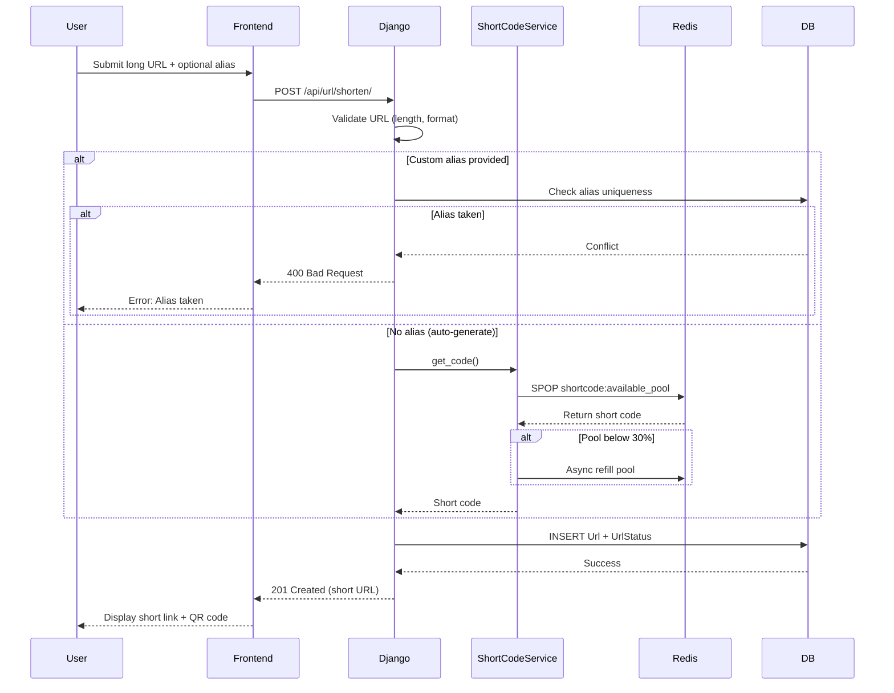
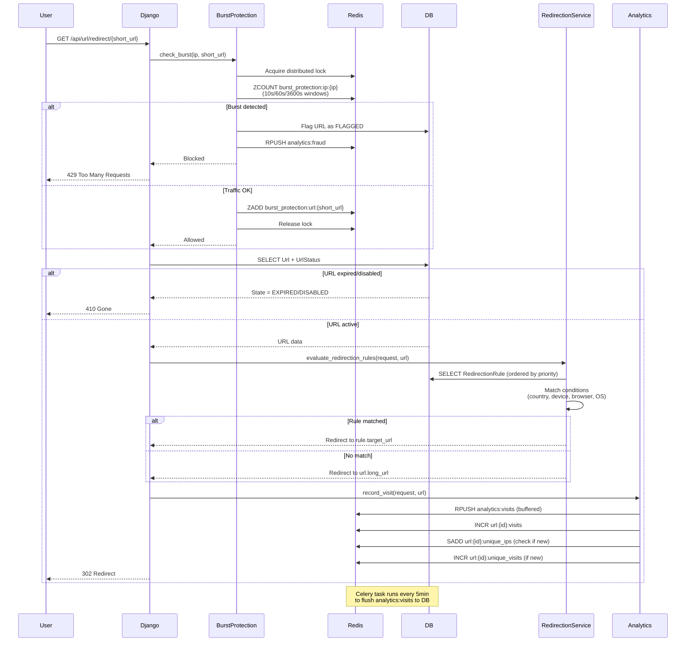
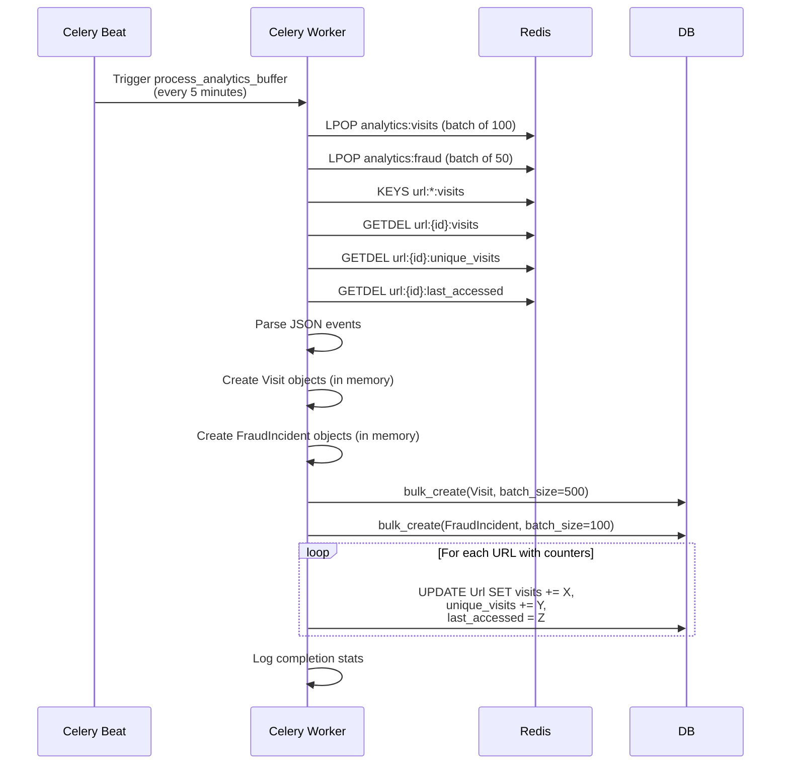

# System Architecture

This document provides a comprehensive overview of the URL Shortener system architecture, component breakdown, and key request flows.

## High-Level Architecture



**Key Components:**

- **Web Browser** - End users accessing the service
- **Next.js Frontend** - React-based UI with server-side rendering
- **Django API** - RESTful backend with DRF (Django REST Framework)
- **PostgreSQL** - Primary data store with ACID guarantees
- **Redis** - Multi-purpose: code pool, analytics buffer, burst protection, Celery broker
- **Celery Workers** - Asynchronous task processors
- **Celery Beat** - Periodic task scheduler

## Component Breakdown

### Backend Services (`api/`)

The Django backend is organized as a modular monolith with dedicated apps for each domain:

#### URL Management (`api/url/`)

**Purpose:** Core URL shortening functionality, redirection, and health monitoring

**Directory Structure:**

```
api/url/
├── models.py                    # Url, UrlStatus models
├── views.py                     # API endpoints (shorten, redirect, QR)
├── serializers/                 # Request/response serializers
├── services/
│   ├── UrlService.py           # Business logic for URL CRUD
│   ├── ShortCodeService.py     # Redis pool management
│   └── BurstProtectionService.py # Multi-window burst detection
├── redirection/                 # Priority-based redirection rules
│   ├── models.py               # RedirectionRule model
│   ├── RedirectionService.py   # Rule evaluation engine
│   └── views.py                # Rule management endpoints
├── link_rot/                    # URL health checking
│   ├── LinkRotService.py       # Batch health check service
│   └── views.py                # Health check endpoints
├── tasks.py                     # Celery tasks (cleanup, pool refill)
└── utils.py                     # QR code generation, helpers
```

**Key Responsibilities:**

- **UrlService** - URL creation with validation, batch operations, pagination
- **ShortCodeService** - Redis-backed pool management (SPOP, SADD operations)
- **BurstProtectionService** - Multi-window traffic analysis with distributed locking
- **RedirectionService** - JSON condition evaluation (country, device, browser, OS, time)
- **LinkRotService** - Async batch URL health checking with status updates

#### Analytics (`api/analytics/`)

**Purpose:** Visit tracking, aggregation, and reporting

**Directory Structure:**

```
api/analytics/
├── models.py          # Visit model (hashed_ip, geolocation, device, etc.)
├── service.py         # AnalyticsService (record_visit, aggregations)
├── views.py           # Analytics endpoints (summary, stats, top URLs)
└── utils.py           # IP hashing, geolocation, user-agent parsing
```

**Key Responsibilities:**

- **AnalyticsService.record_visit()** - Buffers visit data to Redis `analytics:visits` list
- **Fraud detection** - Identifies suspicious user agents (curl, wget, empty UA)
- **Aggregation queries** - Top devices, browsers, countries, daily visit trends
- **User stats** - Per-user click counts, active links, top referrers

#### Authentication (`api/custom_auth/`)

**Purpose:** User management and authentication

**Directory Structure:**

```
api/custom_auth/
├── models.py          # CustomUser (extends AbstractUser with Role field)
├── authentication.py  # CookieJWTAuthentication
├── views.py           # Auth endpoints (login, logout)
└── urls.py            # Auth routing
```

**Key Features:**

- **Role-based access control** - Admin, Staff, User roles
- **Cookie-based JWT** - Secure token storage (httpOnly cookies)
- **Djoser integration** - Registration, password reset, email verification

#### Admin Panel (`api/admin_panel/`)

**Purpose:** Administrative interfaces and system management

**Directory Structure:**

```
api/admin_panel/
├── fraud/             # Fraud incident tracking
│   ├── models.py     # FraudIncident (type, severity, details JSON)
│   └── FraudService.py # Fraud logging service
├── audit/             # Audit logging
│   ├── models.py     # AuditLog (action, changes JSON, IP)
│   └── views.py      # Audit query endpoints
├── system/            # System configuration
│   ├── models.py     # SystemConfiguration (key-value store)
│   └── views.py      # Config management endpoints
├── insight/           # Analytics and reporting
│   └── views.py      # System-wide insights
├── user_management/   # User CRUD operations
│   └── views.py      # User management endpoints
└── url_management/    # Admin URL operations
    └── views.py       # URL management endpoints
```

**Key Features:**

- **Fraud monitoring** - Burst protection events, throttle violations, suspicious UA
- **Audit trail** - Full action history with JSON change diffs
- **System config** - Centralized settings (rate limits, pool size, etc.)
- **Insights** - System-wide analytics and health metrics

### Frontend Application (`frontend/`)

**Purpose:** User interface built with Next.js App Router

**Directory Structure:**

```
frontend/
├── app/
│   ├── (public)/      # Landing page, about, help
│   ├── (auth)/        # Login, signup, password reset
│   ├── (user)/        # User dashboard, URL management, settings
│   │   ├── dashboard/ # Analytics dashboard
│   │   ├── urls/      # URL CRUD interface
│   │   └── settings/  # User settings
│   └── admin/         # Admin panel
│       ├── dashboard/
│       ├── users/
│       ├── urls/
│       ├── fraud/
│       ├── audit/
│       └── insights/
├── components/
│   ├── ui/            # Radix UI primitives
│   ├── tables/        # Data tables (URLs, users, audit, fraud)
│   ├── admin/         # Admin-specific components
│   └── user-pages/    # User dashboard components
└── lib/               # API client, utilities
```

**Key Features:**

- **Server Components** - Performance optimization with RSC
- **Client Components** - Interactive tables, forms, charts
- **Responsive design** - Mobile-first with Tailwind CSS
- **Real-time updates** - Analytics charts with recharts
- **Map visualization** - Geographic analytics with react-leaflet

### Configuration (`config/`)

**Purpose:** Django project settings and Celery configuration

**Key Files:**

- `settings/base.py` - Base settings for all environments
- `settings/dev.py` - Development configuration
- `settings/prod.py` - Production configuration
- `celery.py` - Celery app initialization and task discovery
- `redis_utils.py` - Redis connection pool management
- `urls.py` - Root URL routing

## Key Request Flows

### URL Shortening Flow



**Performance Notes:**

- **Pool-based generation** - Eliminates collision retries (O(1) vs O(n) retries)
- **Async pool refill** - Non-blocking refill when pool drops below threshold
- **Single DB transaction** - Url and UrlStatus created atomically

### URL Redirection Flow (Performance Critical)



**Performance Optimizations:**

1. **Burst protection first** - Blocks malicious traffic before DB queries
2. **Single DB query** - `select_related('url_status')` avoids N+1 queries
3. **Redis buffering** - Visit recording takes <1ms (vs 20-50ms direct DB write)
4. **Batch analytics** - 100 visits inserted in single bulk query
5. **Distributed locking** - Prevents race conditions in burst detection

**Latency Breakdown:**

- **Without buffering:** 50-70ms total (DB insert: 20-50ms)
- **With buffering:** 8-12ms total (Redis RPUSH: <1ms)
- **Improvement:** 6x faster redirects

### Analytics Batch Processing Flow



**Benefits:**

- **Reduced DB load** - 1 query per 500 visits (vs 500 individual INSERTs)
- **Non-blocking redirects** - Analytics don't slow down user experience
- **Eventual consistency** - 5-minute delay acceptable for analytics

## Deployment Architecture

### Development

- **Django:** `python manage.py runserver` (auto-reload)
- **Celery Worker:** `celery -A config worker`
- **Celery Beat:** `celery -A config beat`
- **Frontend:** `bun run dev` (hot reload)
- **PostgreSQL:** Local instance (port 5432)
- **Redis:** Local instance (port 6379)

### Docker Compose (Recommended)

```yaml
services:
  web:        # Django + Gunicorn
  db:         # PostgreSQL 15
  redis:      # Redis 7-alpine
  celery:     # Celery worker
  celery-beat: # Celery Beat scheduler
```

**Benefits:**

- **Isolated environments** - No dependency conflicts
- **Easy setup** - `docker-compose up` starts all services
- **Production-like** - Uses Gunicorn instead of dev server

### Production Considerations

**Recommended architecture:**

- **Web servers:** Multiple Gunicorn workers behind Nginx reverse proxy
- **Celery workers:** Separate worker pool (4-8 workers depending on load)
- **PostgreSQL:** Managed service (AWS RDS, Google Cloud SQL) with automated backups
- **Redis:** Managed service (AWS ElastiCache, Redis Cloud) with persistence enabled
- **Frontend:** Static build deployed to CDN (Vercel, Netlify, CloudFront)

**Scaling strategies:**

1. **Horizontal scaling:** Add more Gunicorn workers and Celery workers
2. **Database optimization:** Read replicas for analytics queries
3. **Redis optimization:** Separate Redis instances for different use cases (pool, buffer, broker)
4. **CDN:** Serve QR codes and static assets from CDN
5. **Monitoring:** Prometheus + Grafana for metrics, Sentry for error tracking

## Technology Choices

### Why Django REST Framework?

✅ **Pros:**
- Automatic OpenAPI schema generation (drf-spectacular)
- Serializers handle validation and transformation
- Built-in pagination, filtering, throttling
- ViewSets reduce boilerplate code

❌ **Cons:**
- Learning curve for serializers
- Can be verbose for simple endpoints

**Decision:** DRF's serializers and viewsets significantly reduce development time while ensuring consistent API patterns.

### Why Celery?

✅ **Pros:**
- Battle-tested async task queue
- Built-in periodic task scheduling (Beat)
- Redis broker integration
- Extensive monitoring tools

❌ **Cons:**
- Additional service to manage
- Can be complex for simple use cases

**Decision:** Celery is essential for analytics buffering, link health checks, and scheduled cleanup tasks. The complexity is justified by the performance gains.

### Why Redis over Alternatives?

**Compared to Memcached:**

- Redis supports multiple data structures (lists, sets, sorted sets) needed for buffering, pools, and burst tracking
- Redis can persist data to disk (AOF, RDB)
- Redis works as Celery broker

**Compared to RabbitMQ (for Celery):**

- Redis is simpler to set up and manage
- Already using Redis for caching/buffering
- Consolidating to one technology reduces complexity

**Decision:** Redis serves four critical functions (pool, buffer, burst tracking, Celery broker), making it more cost-effective than multiple specialized services.

## Security Considerations

### Authentication

- **JWT tokens** - Short-lived access tokens (15min), longer refresh tokens (7 days)
- **HttpOnly cookies** - Tokens stored in secure cookies, not localStorage
- **CORS** - Strict origin validation
- **CSP headers** - Content Security Policy prevents XSS attacks

### Rate Limiting

- **IP-based throttling** - DRF throttle classes (configurable rates)
- **User-based throttling** - Authenticated users have higher limits
- **Burst protection** - Multi-window detection prevents DDoS

### Data Protection

- **IP hashing** - SHA-256 hash before storage (GDPR compliance)
- **Password hashing** - Django's PBKDF2 with 390,000 iterations
- **SQL injection prevention** - Django ORM parameterized queries
- **XSS prevention** - Django template auto-escaping

### Audit Trail

- **AuditLog model** - Tracks all CREATE/UPDATE/DELETE actions
- **JSON change tracking** - Before/after state for all modifications
- **IP logging** - Source IP for all administrative actions

## Performance Metrics

### Redirect Performance

| Metric | Without Buffering | With Buffering | Improvement |
|--------|------------------|----------------|-------------|
| P50 Latency | 45ms | 8ms | 5.6x |
| P95 Latency | 70ms | 12ms | 5.8x |
| P99 Latency | 120ms | 18ms | 6.7x |
| DB Writes/min | 1000 | 0.2 | 5000x reduction |

### Database Efficiency

| Operation | Without Optimization | With Optimization | Improvement |
|-----------|---------------------|-------------------|-------------|
| Analytics Insert | 1 query per visit | 1 query per 500 visits | 500x |
| Short Code Generation | 1-3 retries average | 0 retries | Elimination |
| URL List Query | N+1 queries | 1 query | Nx reduction |

### Redis Memory Usage

| Data Structure | Avg Size | Purpose | TTL |
|----------------|----------|---------|-----|
| `shortcode:available_pool` | 5MB | Pre-generated codes | None |
| `analytics:visits` | 2MB | Buffered visit events | 5min |
| `url:{id}:unique_ips` | 100KB/URL | Unique visitor tracking | 30 days |
| `burst_protection:*` | 50KB/IP | Traffic tracking | 1 hour |

**Total estimated Redis memory:** ~100MB for 10,000 active URLs with moderate traffic.

## Monitoring and Observability

### Logging

- **Django logging** - INFO level for requests, ERROR for exceptions
- **Celery logging** - Task execution times, failures, retries
- **Custom metrics** - Analytics buffer size, pool size, burst events

### Health Checks

- **Database** - PostgreSQL connection check
- **Redis** - PING command
- **Celery** - Worker heartbeat monitoring

### Metrics to Track

1. **Redirect latency** - P50, P95, P99
2. **Analytics buffer size** - Alert if > 10,000 events
3. **Short code pool size** - Alert if < 1,000 codes
4. **Celery task lag** - Time from enqueue to execution
5. **Database connection pool** - Active connections
6. **Fraud event rate** - Burst protection triggers per hour

---

**Related Documentation:**

- [Database Design](database.md)
- [Design Decisions](design-decisions.md)
- [API Documentation](api.md)
- [Analytics Deep-Dive](deep-dive-analytics.md)
