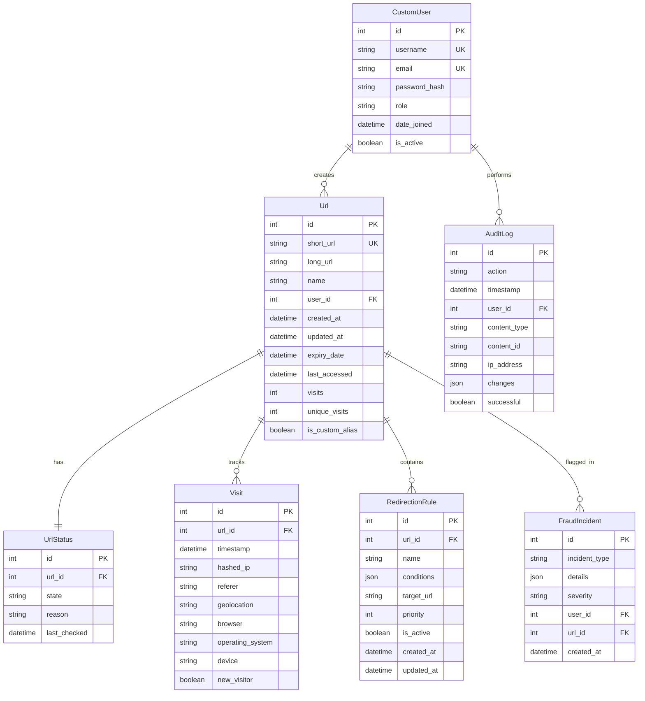

# Database Design

This document details the database schema, models, indexes, and data management strategies for the URL Shortener system.

## Entity Relationship Diagram



## Core Models

### CustomUser Model

**Purpose:** Extended user model with role-based access control

**Location:** `api/custom_auth/models.py`

| Field | Type | Constraints | Purpose | Indexed |
|-------|------|-------------|---------|---------|
| id | INTEGER | PK, AUTO_INCREMENT | Primary key | ✅ |
| username | VARCHAR(150) | UNIQUE, NOT NULL | Login identifier | ✅ |
| email | VARCHAR(254) | UNIQUE, NOT NULL | Email address | ✅ |
| password | VARCHAR(128) | NOT NULL | PBKDF2 hashed password | ❌ |
| role | VARCHAR(32) | DEFAULT='USER' | ADMIN/STAFF/USER | ✅ |
| date_joined | TIMESTAMP | NOT NULL | Registration date | ❌ |
| is_active | BOOLEAN | DEFAULT=TRUE | Account status | ✅ |
| is_staff | BOOLEAN | DEFAULT=FALSE | Django admin access | ✅ |

**Indexes:**

```sql
CREATE INDEX idx_user_role ON custom_auth_customuser(role);
CREATE INDEX idx_user_active ON custom_auth_customuser(is_active);
CREATE UNIQUE INDEX idx_user_username ON custom_auth_customuser(username);
CREATE UNIQUE INDEX idx_user_email ON custom_auth_customuser(email);
```

**Design Decisions:**

✅ **Role enum** - Simplifies permission checks (`user.role == CustomUser.Role.ADMIN`)

✅ **Email as unique** - Allows username OR email login

✅ **Extends AbstractUser** - Inherits Django's battle-tested auth system

**Role Hierarchy:**

- **ADMIN** - Full system access, user management, system configuration
- **STAFF** - URL management, audit log access, limited user management
- **USER** - Own URL management only

### Url Model

**Purpose:** Core model storing shortened URLs with metadata

**Location:** `api/url/models.py`

| Field | Type | Constraints | Purpose | Indexed |
|-------|------|-------------|---------|---------|
| id | INTEGER | PK, AUTO_INCREMENT | Primary key | ✅ |
| short_url | VARCHAR(64) | UNIQUE, NOT NULL | Short code identifier | ✅ |
| long_url | VARCHAR(2000) | NOT NULL | Target URL (max 2048 chars) | ❌ |
| name | VARCHAR(512) | NULL | User-defined label | ❌ |
| user_id | FK(CustomUser) | NULL | Owner (NULL for anonymous) | ✅ |
| created_at | TIMESTAMP | NOT NULL | Creation timestamp | ✅ |
| updated_at | TIMESTAMP | NOT NULL | Last modification | ❌ |
| expiry_date | TIMESTAMP | NULL | Optional expiration | ✅ |
| last_accessed | TIMESTAMP | NULL | Last redirect timestamp | ✅ |
| visits | INTEGER | DEFAULT=0 | Total click count | ❌ |
| unique_visits | INTEGER | DEFAULT=0 | Unique visitor count | ❌ |
| is_custom_alias | BOOLEAN | DEFAULT=FALSE | Custom vs generated | ❌ |

**Indexes:**

```sql
-- Critical for redirect lookups
CREATE UNIQUE INDEX idx_url_short_url ON url_url(short_url);

-- User dashboard queries (My URLs, sorted by date)
CREATE INDEX idx_url_user_created ON url_url(user_id, created_at DESC);

-- Cleanup job efficiency
CREATE INDEX idx_url_expiry ON url_url(expiry_date) WHERE expiry_date IS NOT NULL;

-- Analytics queries
CREATE INDEX idx_url_last_accessed ON url_url(last_accessed);
```

**Design Decisions:**

✅ **Auto-increment PK** - Simple, predictable, excellent for range queries

✅ **UNIQUE constraint on short_url** - Database-level collision prevention

✅ **Denormalized counters** (visits, unique_visits):
- **Pro:** Dashboard queries 10x faster (no COUNT(*) on large Visit table)
- **Con:** Slight inconsistency risk (mitigated by Redis atomic operations)
- **Trade-off:** Acceptable for analytics use case

✅ **Soft delete via UrlStatus** - Preserves data for audit, allows restoration

✅ **VARCHAR(2000) for long_url** - Handles most URLs (RFC 2616 suggests 2048 char limit)

❌ **Why NOT UUID primary key?**
- Auto-increment is simpler and more efficient for joins
- No distributed generation needed (single PostgreSQL instance)
- URL enumeration not a security concern (short_url is the public identifier)

### UrlStatus Model

**Purpose:** Tracks URL lifecycle state separately from core Url data

**Location:** `api/url/models.py`

| Field | Type | Constraints | Purpose | Indexed |
|-------|------|-------------|---------|---------|
| id | INTEGER | PK, AUTO_INCREMENT | Primary key | ✅ |
| url_id | FK(Url) | UNIQUE (OneToOne) | Associated URL | ✅ |
| state | VARCHAR(16) | DEFAULT='ACTIVE' | Lifecycle state | ✅ |
| reason | VARCHAR(256) | NULL | State change reason | ❌ |
| last_checked | TIMESTAMP | NULL | Last health check | ✅ |

**State Enum:**

```python
class State(models.TextChoices):
    ACTIVE = "ACTIVE", "active"           # Normal operation
    EXPIRED = "EXPIRED", "expired"         # Past expiry_date
    FLAGGED = "FLAGGED", "flagged"         # Burst protection triggered
    DISABLED = "DISABLED", "disabled"      # Admin disabled
    BROKEN = "BROKEN", "broken"            # Link rot detected
```

**Indexes:**

```sql
CREATE INDEX idx_urlstatus_state ON url_urlstatus(state);
CREATE INDEX idx_urlstatus_checked ON url_urlstatus(last_checked);
CREATE INDEX idx_urlstatus_state_checked ON url_urlstatus(state, last_checked);
```

**Design Decisions:**

✅ **Separate table** - Keeps Url model focused on data, UrlStatus on lifecycle

✅ **OneToOne relationship** - Each URL has exactly one status

✅ **Indexed state** - Fast queries for active URLs, expired URLs, etc.

**Common Queries:**

```python
# Get all active URLs
Url.objects.filter(url_status__state=UrlStatus.State.ACTIVE)

# Find URLs needing health check (link rot)
UrlStatus.objects.filter(
    last_checked__lt=timezone.now() - timedelta(days=7)
).select_related('url')
```

### Visit Model

**Purpose:** Analytics data for each URL visit/click

**Location:** `api/analytics/models.py`

| Field | Type | Constraints | Purpose | Indexed |
|-------|------|-------------|---------|---------|
| id | INTEGER | PK, AUTO_INCREMENT | Primary key | ✅ |
| url_id | FK(Url) | NOT NULL | Associated URL | ✅ |
| timestamp | TIMESTAMP | NOT NULL | Visit timestamp | ✅ |
| hashed_ip | VARCHAR(64) | NOT NULL | SHA-256 IP hash | ❌ |
| referer | TEXT | NULL | HTTP Referer header | ❌ |
| geolocation | VARCHAR(128) | NULL | Country code | ✅ |
| browser | VARCHAR(64) | NULL | Browser name | ✅ |
| operating_system | VARCHAR(64) | NULL | OS name | ✅ |
| device | VARCHAR(64) | NULL | Device type | ✅ |
| new_visitor | BOOLEAN | DEFAULT=TRUE | First-time visitor | ❌ |

**Indexes:**

```sql
-- Critical for URL analytics queries
CREATE INDEX idx_visit_url_timestamp ON analytics_visit(url_id, timestamp DESC);

-- Geolocation analytics
CREATE INDEX idx_visit_geolocation ON analytics_visit(geolocation);

-- Device/browser analytics
CREATE INDEX idx_visit_browser ON analytics_visit(browser);
CREATE INDEX idx_visit_os ON analytics_visit(operating_system);
CREATE INDEX idx_visit_device ON analytics_visit(device);
```

**Design Decisions:**

✅ **Hashed IP** - Privacy-preserving (GDPR compliance) while allowing unique visitor tracking

✅ **Denormalized user agent parsing** - Browser/OS/device stored separately for efficient aggregation

✅ **No IP storage** - Only SHA-256 hash stored (irreversible, anonymous)

✅ **Composite index (url_id, timestamp)** - Optimizes time-series analytics queries

**Privacy Considerations:**

```python
# IP hashing implementation
import hashlib

def hash_ip(ip: str) -> str:
    return hashlib.sha256(ip.encode()).hexdigest()
```

- **One-way hash** - Cannot reverse to original IP
- **Consistent** - Same IP always produces same hash (unique visitor tracking)
- **Anonymous** - Complies with GDPR Article 4(5) - pseudonymization

**Estimated Table Size:**

- **10,000 URLs** with **1,000 clicks each** = 10 million rows
- **Row size:** ~150 bytes (estimated)
- **Total size:** 1.5 GB (plus indexes ~500 MB) = **2 GB total**

**Retention Strategy:**

- **Keep forever** - Analytics are core feature
- **Partition by month** - Consider partitioning if table exceeds 50 million rows
- **Archive to data warehouse** - For long-term analytics (optional)

### RedirectionRule Model

**Purpose:** Conditional redirect rules based on request context

**Location:** `api/url/redirection/models.py`

| Field | Type | Constraints | Purpose | Indexed |
|-------|------|-------------|---------|---------|
| id | INTEGER | PK, AUTO_INCREMENT | Primary key | ✅ |
| url_id | FK(Url) | NOT NULL | Associated URL | ✅ |
| name | VARCHAR(255) | NOT NULL | Descriptive label | ❌ |
| conditions | JSON | NOT NULL | Match conditions | ❌ |
| target_url | VARCHAR(2000) | NOT NULL | Redirect destination | ❌ |
| priority | INTEGER | DEFAULT=0 | Evaluation order | ✅ |
| is_active | BOOLEAN | DEFAULT=TRUE | Enable/disable | ✅ |
| created_at | TIMESTAMP | NOT NULL | Creation timestamp | ❌ |
| updated_at | TIMESTAMP | NOT NULL | Last modification | ❌ |

**Indexes:**

```sql
-- Critical for rule evaluation (highest priority first)
CREATE INDEX idx_redir_url_priority ON url_redirectionrule(url_id, priority DESC);

-- Filter active rules only
CREATE INDEX idx_redir_active ON url_redirectionrule(is_active);
```

**Conditions JSON Schema:**

```json
{
  "country": ["US", "CA"],           // ISO 3166-1 alpha-2 codes
  "device_type": ["mobile", "tablet"],
  "browser": ["Chrome", "Firefox"],
  "os": ["iOS", "Android"],
  "language": ["en", "es"],
  "time_range": {
    "start": "09:00",
    "end": "17:00",
    "timezone": "America/New_York"
  },
  "mobile": true,                    // Boolean: is mobile device?
  "referer": ["google.com", "twitter.com"]
}
```

**Design Decisions:**

✅ **Priority-based evaluation** - Higher priority rules checked first (ORDER BY priority DESC)

✅ **JSON conditions** - Flexible schema without schema migrations

✅ **Multiple conditions** - All conditions must match (AND logic)

✅ **Active flag** - Temporarily disable rules without deletion

**Example Query:**

```python
# Get active rules for URL, ordered by priority
rules = RedirectionRule.objects.filter(
    url_id=url.id,
    is_active=True
).order_by('-priority')

# Evaluate rules
for rule in rules:
    if evaluate_conditions(rule.conditions, request):
        return redirect(rule.target_url)
```

**Use Cases:**

1. **Geographic routing** - US traffic → US landing page, EU → EU landing page
2. **Device-specific** - Mobile → mobile app store, desktop → website
3. **A/B testing** - 50% priority 10 → Version A, 50% priority 5 → Version B
4. **Time-based** - Business hours → sales page, after hours → contact form
5. **Referrer-based** - Social media traffic → special promo page

### FraudIncident Model

**Purpose:** Track fraud detection events for security monitoring

**Location:** `api/admin_panel/fraud/models.py`

| Field | Type | Constraints | Purpose | Indexed |
|-------|------|-------------|---------|---------|
| id | INTEGER | PK, AUTO_INCREMENT | Primary key | ✅ |
| incident_type | VARCHAR(20) | NOT NULL | Event type | ✅ |
| details | JSON | NOT NULL | Event details | ❌ |
| severity | VARCHAR(10) | DEFAULT='low' | Severity level | ✅ |
| user_id | FK(CustomUser) | NULL | Associated user | ❌ |
| url_id | FK(Url) | NULL | Associated URL | ❌ |
| created_at | TIMESTAMP | NOT NULL | Incident timestamp | ✅ |

**Incident Types:**

```python
INCIDENT_TYPES = [
    ("burst", "Burst Protection Triggered"),      # Multi-window limit exceeded
    ("throttle", "Throttle Violation"),           # DRF rate limit hit
    ("suspicious_ua", "Suspicious User Agent"),   # curl, wget, empty UA
    ("other", "Other"),                           # Custom incidents
]

SEVERITY_LEVELS = [
    ("low", "Low"),          # Informational (empty UA)
    ("medium", "Medium"),    # Suspicious activity (scripting tools)
    ("high", "High"),        # Definite attack (burst threshold exceeded)
]
```

**Indexes:**

```sql
CREATE INDEX idx_fraud_type ON fraud_fraudincident(incident_type);
CREATE INDEX idx_fraud_created ON fraud_fraudincident(created_at);
CREATE INDEX idx_fraud_severity ON fraud_fraudincident(severity);
```

**Details JSON Examples:**

```json
// Burst protection
{
  "ip": "192.168.1.1",
  "short_url": "abc123",
  "window": "short_term",
  "count": 15,
  "threshold": 10,
  "timestamp": "2024-01-15T10:30:00Z"
}

// Suspicious UA
{
  "user_agent": "curl/7.68.0",
  "ip": "192.168.1.1",
  "url": "abc123",
  "pattern": "scripting"
}
```

**Design Decisions:**

✅ **JSON details** - Flexible schema for different incident types

✅ **Severity levels** - Prioritize security team response

✅ **Nullable user/url** - Some incidents may not be URL-specific

### AuditLog Model

**Purpose:** Comprehensive audit trail for compliance and security

**Location:** `api/admin_panel/audit/models.py`

| Field | Type | Constraints | Purpose | Indexed |
|-------|------|-------------|---------|---------|
| id | INTEGER | PK, AUTO_INCREMENT | Primary key | ✅ |
| action | VARCHAR(32) | NOT NULL | Action type | ✅ |
| timestamp | TIMESTAMP | NOT NULL | Action timestamp | ✅ |
| user_id | FK(CustomUser) | NULL | Actor (NULL for system) | ❌ |
| content_type | VARCHAR(128) | NULL | Model name | ❌ |
| content_id | VARCHAR(128) | NULL | Object ID | ❌ |
| ip_address | INET | NULL | Source IP | ✅ |
| changes | JSON | NULL | Before/after state | ❌ |
| successful | BOOLEAN | NULL | Operation result | ❌ |

**Action Enum:**

```python
class Actions(models.TextChoices):
    CREATE = "CREATE", "create"
    UPDATE = "UPDATE", "update"
    DELETE = "DELETE", "delete"
    GET = "GET", "get"
```

**Indexes:**

```sql
-- User activity timeline
CREATE INDEX idx_audit_user_timestamp ON audit_auditlog(user_id, timestamp DESC);

-- IP-based investigation
CREATE INDEX idx_audit_ip ON audit_auditlog(ip_address);

-- Action filtering
CREATE INDEX idx_audit_action ON audit_auditlog(action);
```

**Changes JSON Example:**

```json
{
  "before": {
    "state": "ACTIVE",
    "expiry_date": "2024-12-31"
  },
  "after": {
    "state": "DISABLED",
    "expiry_date": "2024-12-31"
  }
}
```

**Design Decisions:**

✅ **Generic content_type/content_id** - Works with any model

✅ **JSON changes** - Full audit trail without separate change tables

✅ **IP logging** - Security investigation support

✅ **Nullable user** - System-initiated actions (Celery tasks)

## Short Code Generation Algorithm

### Overview

The system uses a **Redis-backed pool** strategy for generating short codes, eliminating collision retries and ensuring consistent performance.

**Location:** `api/url/services/ShortCodeService.py`

### Algorithm Details

**Character Set:**

```python
CHARS = string.ascii_letters + string.digits  # [a-zA-Z0-9]
# Total: 62 characters
```

**Default Code Length:** 6 characters (configurable)

**Capacity:** 62^6 = **56.8 billion** possible codes

### Implementation

```python
class ShortCodeService:
    """Service for generating and managing short codes using Redis pool."""
    
    CHARS = string.ascii_letters + string.digits
    POOL_KEY = "shortcode:available_pool"
    MIN_POOL_SIZE = 10000  # Configurable
    CODE_LENGTH = 6        # Configurable
    
    def generate_code(self) -> str:
        """Generate a random short code of configured length."""
        return ''.join(random.choices(self.CHARS, k=self.CODE_LENGTH))
    
    def get_code(self) -> str:
        """Retrieve a short code from the pool or generate new one."""
        # Pop from Redis Set (O(1) operation)
        code = self.redis_client.spop(self.POOL_KEY)
        
        # Check pool size
        current_size = self.redis_client.scard(self.POOL_KEY)
        
        # Empty pool - generate on-demand and trigger refill
        if current_size == 0:
            self.refill_pool()
            return self.generate_code()
        
        # Low pool - async refill (non-blocking)
        if current_size < self.MIN_POOL_SIZE * 0.3:
            self.refill_pool()
        
        return code
    
    def refill_pool(self, target_size: int = None) -> int:
        """Refill the short code pool to the target size."""
        if target_size is None:
            target_size = self.MIN_POOL_SIZE
        
        current_size = self.redis_client.scard(self.POOL_KEY)
        codes_to_generate = target_size - current_size
        
        if codes_to_generate <= 0:
            return 0
        
        # Generate in batches of 1000 for efficiency
        batch_size = 1000
        generated = 0
        
        while generated < codes_to_generate:
            batch = [
                self.generate_code() 
                for _ in range(min(batch_size, codes_to_generate - generated))
            ]
            # Add to Redis Set (duplicates automatically ignored)
            self.redis_client.sadd(self.POOL_KEY, *batch)
            generated += len(batch)
        
        return generated
```

### Why Pool-Based vs On-Demand?

**On-Demand Generation (Traditional Approach):**

```python
# Pseudocode
while True:
    code = generate_random_code()
    try:
        save_to_database(code)
        break
    except DuplicateError:
        continue  # Retry
```

❌ **Cons:**
- **Variable performance** - Collision retries cause latency spikes
- **Database contention** - Multiple concurrent requests compete
- **Worsens with scale** - Collision probability increases with more URLs

**Pool-Based (Our Approach):**

✅ **Pros:**
- **Constant time** - O(1) Redis SPOP operation
- **Zero collisions** - Set data structure ensures uniqueness
- **Async refill** - Pool replenishment doesn't block requests
- **Batch efficiency** - Generate 1000 codes at once

❌ **Cons:**
- **Memory overhead** - ~60KB for 10,000 codes in Redis
- **Rare duplicates possible** - If pool empties and random generation collides (mitigated by database UNIQUE constraint as final safeguard)

### Collision Probability Analysis

| URLs Stored | Collision Probability (6 chars) | Recommended Action |
|-------------|--------------------------------|-------------------|
| 1,000 | 0.000001% | No action needed |
| 10,000 | 0.0001% | No action needed |
| 100,000 | 0.01% | No action needed |
| 1,000,000 | 1% | Consider 7 characters |
| 10,000,000 | 10% | Use 7 characters |

**Capacity with different lengths:**

- **6 chars:** 62^6 = 56.8 billion
- **7 chars:** 62^7 = 3.5 trillion
- **8 chars:** 62^8 = 218 trillion

### Pool Management Strategy

**Initial Setup:**

```sql
-- Celery Beat task runs on startup
refill_pool(target_size=10000)
```

**Ongoing Maintenance:**

1. **Per-request check** - If pool < 30% (3,000 codes), trigger async refill
2. **Scheduled refill** - Celery Beat task runs hourly to maintain MIN_POOL_SIZE
3. **Emergency generation** - If pool empty, generate on-demand + trigger refill

**Redis Memory Usage:**

- **10,000 codes** × 6 chars = ~60 KB
- **100,000 codes** × 6 chars = ~600 KB

**Recommendation:** 10,000 code pool is optimal for most deployments.

## Index Strategy

### Indexing Principles

1. **Index columns used in WHERE clauses**
2. **Index foreign keys** (automatic in PostgreSQL)
3. **Composite indexes** for common query patterns
4. **Avoid over-indexing** - Each index slows writes

### Composite Index Examples

```sql
-- User's URLs sorted by date
CREATE INDEX idx_url_user_created ON url_url(user_id, created_at DESC);

-- Query: SELECT * FROM url_url WHERE user_id = 123 ORDER BY created_at DESC
-- Benefit: Single index scan (no sort needed)

-- URL status with last_checked
CREATE INDEX idx_urlstatus_state_checked ON url_urlstatus(state, last_checked);

-- Query: Find ACTIVE URLs not checked in 7 days
-- SELECT * FROM url_urlstatus 
-- WHERE state = 'ACTIVE' AND last_checked < NOW() - INTERVAL '7 days'
```

### Partial Indexes

```sql
-- Only index URLs with expiry dates
CREATE INDEX idx_url_expiry ON url_url(expiry_date) 
WHERE expiry_date IS NOT NULL;

-- Benefit: Smaller index (excludes 80%+ of URLs without expiry)
-- Use case: Cleanup job finding expired URLs
```

### Index Maintenance

**Autovacuum** - PostgreSQL automatically maintains indexes

**Manual vacuum** (if needed):

```sql
VACUUM ANALYZE url_url;
VACUUM ANALYZE analytics_visit;
```

**Check index usage:**

```sql
SELECT schemaname, tablename, indexname, idx_scan, idx_tup_read
FROM pg_stat_user_indexes
WHERE schemaname = 'public'
ORDER BY idx_scan ASC;
```

**Drop unused indexes:**

```sql
-- If idx_scan is 0 and table has significant data
DROP INDEX IF EXISTS unused_index_name;
```

## Data Retention and Archiving

### Current Strategy

- **URLs** - Keep forever (core data)
- **Visits** - Keep forever (analytics are key feature)
- **AuditLog** - Keep 1 year (compliance requirement)
- **FraudIncident** - Keep 90 days (security monitoring)

### Future Archiving Strategy

**If Visit table exceeds 50 million rows:**

1. **Partition by month** - PostgreSQL table partitioning
2. **Archive old partitions** - Move to data warehouse (BigQuery, Redshift)
3. **Pre-aggregate** - Monthly/yearly summary tables

**Example partitioning:**

```sql
CREATE TABLE analytics_visit_y2024m01 PARTITION OF analytics_visit
    FOR VALUES FROM ('2024-01-01') TO ('2024-02-01');

CREATE TABLE analytics_visit_y2024m02 PARTITION OF analytics_visit
    FOR VALUES FROM ('2024-02-01') TO ('2024-03-01');
```

## Database Performance Tips

### Query Optimization

```python
# BAD: N+1 queries
urls = Url.objects.all()
for url in urls:
    print(url.url_status.state)  # Separate query each iteration

# GOOD: Single query with join
urls = Url.objects.select_related('url_status').all()
for url in urls:
    print(url.url_status.state)  # No additional query
```

### Connection Pooling

```python
# settings.py
DATABASES = {
    'default': {
        'ENGINE': 'django.db.backends.postgresql',
        'CONN_MAX_AGE': 600,  # Reuse connections for 10 minutes
    }
}
```

### Read Replicas

**For read-heavy workloads:**

1. **Primary** - All writes (URL creation, visit inserts)
2. **Replica** - Read-only queries (analytics, dashboards)

```python
# Route analytics queries to replica
Visit.objects.using('replica').filter(...)
```

## Backup Strategy

### Recommended Approach

1. **Automated daily backups** - PostgreSQL `pg_dump`
2. **Point-in-time recovery** - WAL archiving
3. **Offsite storage** - S3, Google Cloud Storage
4. **Test restoration** - Monthly drill

### Backup Script Example

```bash
#!/bin/bash
DATE=$(date +%Y%m%d_%H%M%S)
pg_dump -U urlshortener urlshortener | gzip > backup_$DATE.sql.gz
aws s3 cp backup_$DATE.sql.gz s3://backups/urlshortener/
```

---

**Related Documentation:**

- [Architecture Overview](architecture.md)
- [Design Decisions](design-decisions.md)
- [API Documentation](api.md)
